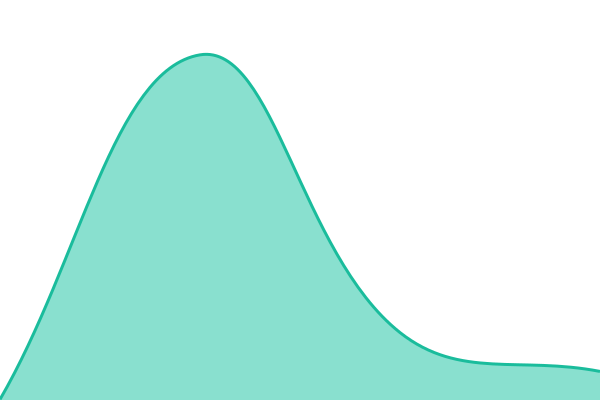
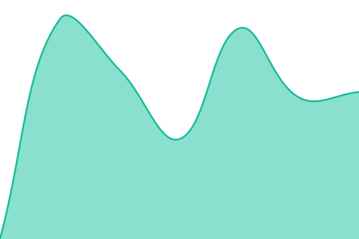

# [📈 Live Status](https://redbing-srl.github.io/redbing-diagnosee-uptime): <!--live status--> **🟩 All systems operational**

This repository contains the open-source uptime monitor and status page for [RedBing](https://redbing.ai/), powered by [Upptime](https://github.com/upptime/upptime).

With [Upptime](https://upptime.js.org), you can get your own unlimited and free uptime monitor and status page, powered entirely by a GitHub repository. We use [Issues](https://github.com/redbing-srl/redbing-diagnosee-uptime/issues) as incident reports, [Actions](https://github.com/redbing-srl/redbing-diagnosee-uptime/actions) as uptime monitors, and [Pages](https://redbing-srl.github.io/redbing-diagnosee-uptime) for the status page.

<!--start: status pages-->
<!-- This summary is generated by Upptime (https://github.com/upptime/upptime) -->
<!-- Do not edit this manually, your changes will be overwritten -->
<!-- prettier-ignore -->
| URL | Status | History | Response Time | Uptime |
| --- | ------ | ------- | ------------- | ------ |
|  [Diagnosee - Web App](https://app.diagnosee.net) | 🟩 Up | [diagnosee-web-app.yml](https://github.com/redbing-srl/redbing-diagnosee-uptime/commits/HEAD/history/diagnosee-web-app.yml) | 

 257ms
     
 | 

<a href="https://redbing-srl.github.io/redbing-diagnosee-uptime/history/diagnosee-web-app">100.00%</a>
    

|  [Diagnosee - Auth](https://app.diagnosee.net/api/auth-health) | 🟩 Up | [diagnosee-auth.yml](https://github.com/redbing-srl/redbing-diagnosee-uptime/commits/HEAD/history/diagnosee-auth.yml) | 

 404ms
     
 | 

<a href="https://redbing-srl.github.io/redbing-diagnosee-uptime/history/diagnosee-auth">100.00%</a>
    

|  [Diagnosee - API](https://app.diagnosee.net/api/trpc/health.db) | 🟩 Up | [diagnosee-api.yml](https://github.com/redbing-srl/redbing-diagnosee-uptime/commits/HEAD/history/diagnosee-api.yml) | 

 409ms
     
 | 

<a href="https://redbing-srl.github.io/redbing-diagnosee-uptime/history/diagnosee-api">100.00%</a>
    

<!--end: status pages-->

[**Visit our status website →**](https://redbing-srl.github.io/redbing-diagnosee-uptime)

## 📄 License

- Powered by: [Upptime](https://github.com/upptime/upptime)
- Code: [MIT](./LICENSE) © [Anand Chowdhary](https://anandchowdhary.com)
- Data in the `./history` directory: [Open Database License](https://opendatacommons.org/licenses/odbl/1-0/)
